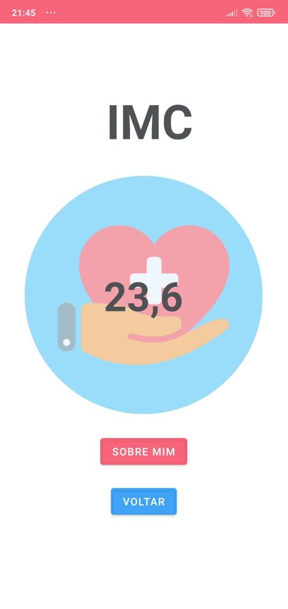
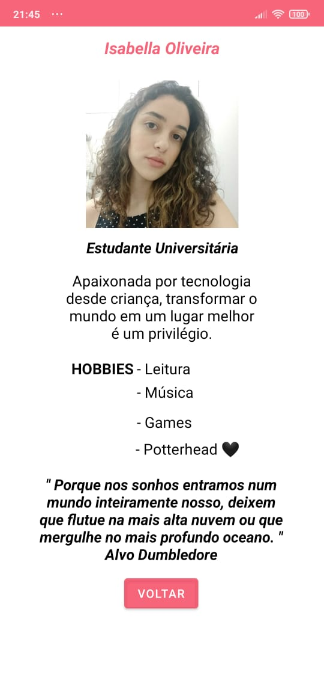

  
Aplicativo feito no Android Studio, utilizando a linguagem Kotlin, durante período de avaliações da faculdade - FIAP.
O objetivo principal é o cálculo de IMC e uma tela falando sobre mim.
Enjoy it :)

# App_IMC
